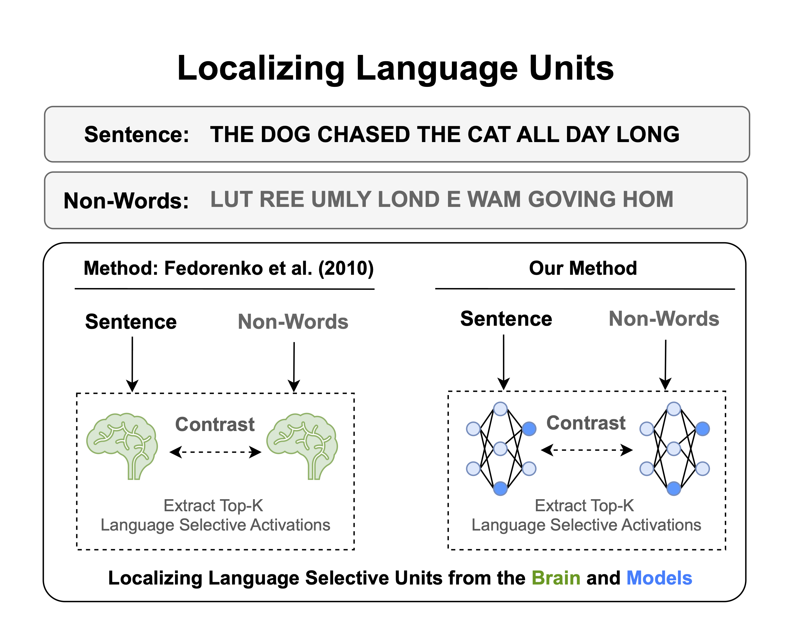

<h1 style="border-bottom: 0; padding-bottom: 0;"> The LLM Language Network </h1>
<h2 style="padding-top: 0;"> A Neuroscientific Approach for Identifying Causally Important Units </h2>
**Authors**: Badr AlKhamissi, Greta Tuckute, Antoine Bosselut*, Martin Schrimpf*
<br>
<small>* Equal Supervision</small>

**Paper Link**: TBD

<div style='text-align: center'>
</img>
</div>

> To identify language-selective units, we compare activations in response to sentences versus non-words, and isolate the units that exhibit the strongest sentence selectivity. The same method is used in neuroscience to localize the human brain's language network.

## Repository Structure

Here’s a well-structured **Repository Structure** section for your ReadMe:

---

### Repository Structure

#### Root Directory
- **`localize.py`**:  
  The main script for localizing selective units within a specified model.
  
- **`datasets.py`**:  
  Handles localizer stimuli loading and processing.

- **`utils.py`**:  
  Contains utility functions used throughout the repository.

- **`model_utils.py`**:  
  Provides model-related utilities.

- **`generate_lesion.py`**:  
  Generates text after applying lesions (ablations) to the localized units.

#### Folders

- **`stimuli/`**:  
  Contains the localizer stimuli required for identifying selective units. These files are downloaded via the `scripts/download.sh` script.

- **`scripts/`**:  
  Contains bash scripts, including `download.sh`, which is used to download the localizer stimuli into the `stimuli` folder.

- **`cache/`**:  
  Stores the localized units' masks, which can be reused or overwritten based on the script options.

## Arguments Description

- `--model-name` (`str`, **required**):  
  Specifies the HuggingFace model name that will be localized. This is a required argument.  
  **Example**: `--model-name meta-llama/Llama-3.2-1B`

- `--percentage` (`float`, *optional*):  
  Defines the percentage of units to localize.  
  **Example**: `--percentage 1` (localizes 1% of the units)

- `--localize-range` (`str`, *optional*, default: `"100-100"`):  
  Determines the percentile range of units to localize.  
  - `"100-100"`: Localizes the top-selective units (most selective).  
  - `"0-0"`: Localizes the least-selective units.  
  - `"x-y"`: Localize random units within that percentile range where `y > x`
  **Example**: `--localize-range 80-90`

- `--network` (`str`, *optional*, default: `"language"`, choices: `["language", "theory-of-mind", "multiple-demand]`):  
  Specifies the network type to localize.  
  **Example**: `--network language`

- `--pooling` (`str`, *optional*, default: `"last-token"`, choices: `["last-token", "mean"]`):  
  Defines the method for token aggregation when localizing units:  
  - `"last-token"`: Uses the last token of the sequence.  
  - `"mean"`: Averages over all tokens in the sequence.  
  **Example**: `--pooling mean`

- `--num-units` (`int`, *optional*):  
  Specifies the exact number of units to localize. If `--percentage` is provided, it overrides this argument.  
  **Example**: `--num-units 1024`

- `--seed` (`int`, *optional*, default: `42`):  
  Sets the random seed for reproducibility of results.  
  **Example**: `--seed 123`

- `--device` (`str`, *optional*):  
  Specifies the device to use (e.g., `"cpu"`, `"cuda:0"`). If not provided, the device will be automatically selected.  
  **Example**: `--device cuda:0`

- `--untrained` (`flag`, *optional*):  
  Use this flag to localize units on an untrained version of the model. No arguments needed for this flag.  
  **Example**: `--untrained` (applies to untrained models)

- `--overwrite` (`flag`, *optional*):  
  Use this flag to overwrite an existing mask if a cached version is found.  
  **Example**: `--overwrite`

## Usage Instructions

1. **Download Language Localizer Stimuli:**
   Run the following command to download the required language stimuli:
   ```bash
   bash scripts/download.sh
   ```
   The files will be saved in the `stimuli/language` directory.

2. **Run the Localization Script:**
   Use the following command to localize the top language-selective units for your chosen model:
   ```bash
   python localize.py 
        --model-name <model_name> 
        --percentage <percentage>
        --network language 
        --localize-range 100-100 
        --pooling last-token
   ```
   This will create a mask in the `cache` directory, which can be used to ablate or extract the identified language-selective units.

## Abstract

Large language models (LLMs) exhibit remarkable capabilities on not just language tasks, but also various other tasks that are not linguistic in nature, such as logical reasoning and social inferences. In the human brain, neuroscience has identified a core language system that specifically supports language processing. We here ask whether similar specialization for language emerges in LLMs. We identify language-selective units within 5 popular LLMs, using the same localizer experiments that are used in neuroscience. To test the causal role of LLM language units, we systematically lesion the localized units which leads to dramatic performance deficits in language tasks, even with a small number of ablations. Lesioning random units leads to almost no difference in performance, establishing LLM language units as functionally meaningful. Correspondingly, language-selective units are more aligned to brain recordings than randomly selected units. Finally, we investigate whether our localization method applies to other cognitive domains: while we again find specialized networks in LLMs for reasoning and social capabilities, there are substantial differences among models. These findings provide functional and causal evidence for specialization in large language models, and highlight parallels with the functional organization in the brain.

## Citation 
TBD